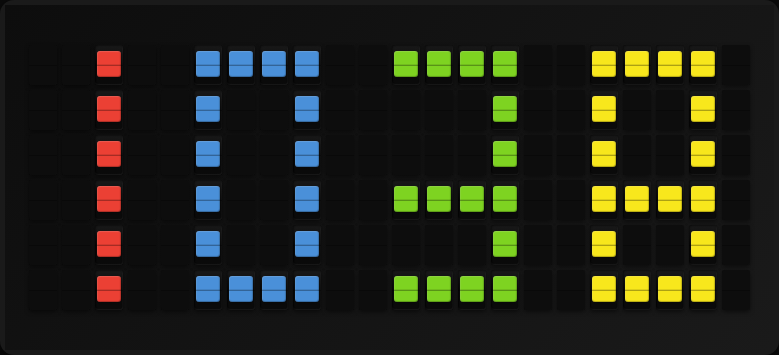

# Visual Clock Plugin

Displays a full-screen clock with large pixel-art style digits, sized to whatever board it is rendering on: a Flagship (22x6), a Note (15x3), or any note array up to 120x24 (which is what a FiestaPanel is).



**→ [Setup Guide](./docs/SETUP.md)** - Configuration and API key setup

## Features

- Full-screen display using colored tiles
- Large, easy-to-read digits (6 rows tall)
- 12-hour or 24-hour time format
- Multiple color patterns (Pride, Rainbow, Sunset, Ocean, Retro, Christmas, Halloween)
- Customizable digit and background colors (solid pattern)
- Timezone support

## Configuration

| Setting | Type | Default | Description |
|---------|------|---------|-------------|
| `timezone` | string | `America/Los_Angeles` | IANA timezone (e.g., `Europe/London`, `Asia/Tokyo`) |
| `time_format` | string | `12h` | Time format: `12h` or `24h` |
| `color_pattern` | string | `solid` | Color pattern (see below) |
| `digit_color` | string | `white` | Color for solid pattern: `red`, `orange`, `yellow`, `green`, `blue`, `violet`, `white` |
| `background_color` | string | `black` | Background color: `red`, `orange`, `yellow`, `green`, `blue`, `violet`, `white`, `black` |

## Color Patterns

| Pattern | Description |
|---------|-------------|
| `solid` | Single color (uses digit_color setting) |
| `pride` | Rainbow rows - each row is a different color (red, orange, yellow, green, blue, violet) |
| `rainbow` | Rainbow digits - each digit is a different color (red, orange, yellow, green, blue, violet) |
| `sunset` | Warm gradient - red at top fading to yellow at bottom |
| `ocean` | Cool gradient - blue at top through green to violet at bottom |
| `retro` | Classic amber LED look - orange and yellow tones |
| `christmas` | Festive - alternating red and green digits |
| `halloween` | Spooky - alternating orange and violet digits |

## Template Variables

| Variable | Description | Example |
|----------|-------------|---------|
| `visual_clock` | Full clock display as string with color markers | `{yellow}{black}...` |
| `time` | Current time as text | `12:34 PM` or `14:34` |
| `time_format` | Current time format setting | `12h` or `24h` |
| `hour` | Current hour | `12` |
| `minute` | Current minute (zero-padded) | `05` |

## Display Layout

The clock is a glyph unit that is integer-scaled and centred on the board it
is drawn on. Nothing is measured in fixed tiles.

```
inline:  [H1][gap][H2][gap][:][gap][M1][gap][M2]
stacked: [H1][gap][H2]
         [M1][gap][M2]
```

- **Big digits** are 4 columns × 6 rows. Their inline unit is exactly 22 × 6,
  so a Flagship is scale 1 and a full 8×8 note array (120 × 24) is scale 4.
- **Compact digits** are 3 columns × 5 rows, for boards too narrow for the
  inline big unit. Their stacked unit is 7 × 11, which is what a tall-narrow
  array (15 × 12 — narrower than a Flagship and twice as tall) renders.
- **Three-row boards** (a Note, or a wide-short array like 120 × 3) cannot
  hold a legible bitmap digit — three rows collapse 2/3/5 and 0/8 into each
  other — so they fall back to the board's own letterforms, letter-spaced to
  the width available.

The layout chosen is the one with the tallest rendered digits, then the one
that covers the most board. The hours slot keeps its width when the leading
zero is blank, so the clock does not shuffle sideways as the hour rolls over.

| Board | Layout |
|---|---|
| Flagship 22×6 | big inline, scale 1 |
| Note 15×3 | letterforms |
| Panel 30×12 (65″) | big inline, scale 1 |
| Panel 45×18 (85″) | big inline, scale 2 |
| Tall-narrow 15×12 | compact stacked, scale 1 |
| Wide-short 120×3 | letterforms |
| Max array 120×24 | big inline, scale 4 |

## Usage

### As a Single Plugin Display

Configure a page to use the `visual_clock` plugin with "single" display type. The full-screen clock will be rendered automatically.

### Using Template Variables

You can also use the template variables in custom templates:

```
{{visual_clock.time}}
```

## Development

### Running Tests

```bash
python scripts/run_plugin_tests.py --plugin=visual_clock
```

### Dependencies

- `pytz` - Timezone handling (included in FiestaBoard core)

## License

MIT License - see the main FiestaBoard LICENSE file.
